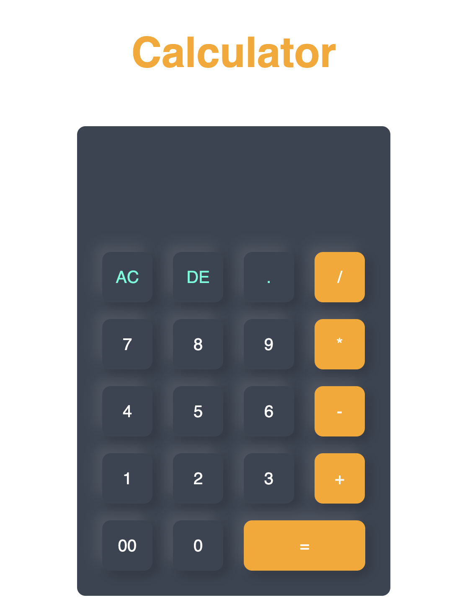

# Basic Calculator App

A simple calculator application built with HTML, CSS, and JavaScript. This app provides basic arithmetic functions: addition, 
subtraction, multiplication, and division.

## Features

- Perform basic arithmetic operations such as addition, subtraction, multiplication, and division.
- User-friendly interface that works on both desktop and mobile browsers.
- Clear and reset functionality for starting new calculations.

## Screenshots

## Technologies Used

- **HTML5**: Structures the basic layout and content of the app, utilizing modern HTML5 tags for semantic clarity.
- **CSS3**: Styles the presentation of the calculator, leveraging advanced CSS3 properties for responsive design and animations.
- **JavaScript (ES6)**: Powers the calculation logic, making use of ES6 features for cleaner code and better performance.
- **Visual Studio Code**: The code editor used for developing the application, chosen for its robust features and extensions 
tailored for web development.
- **Git**: Used for version control to manage the source code changes.
- **GitHub**: Hosts the repository and facilitates the tracking of changes, collaboration, and project management.
